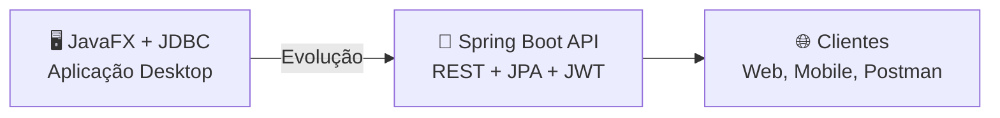
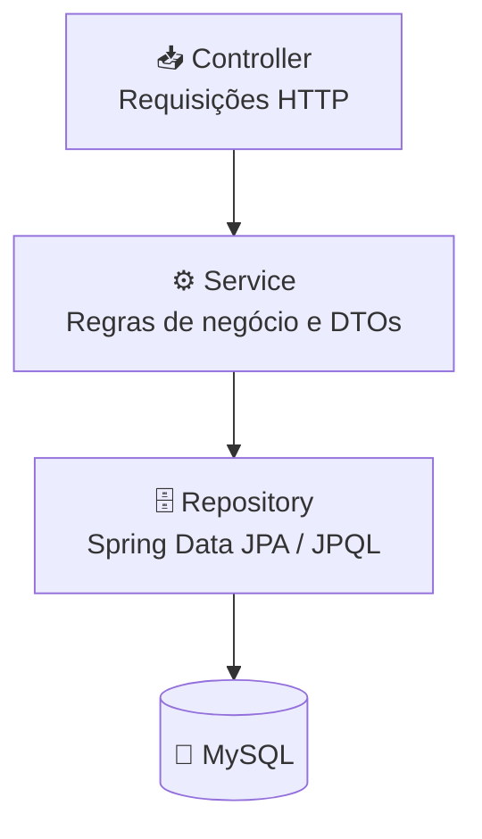
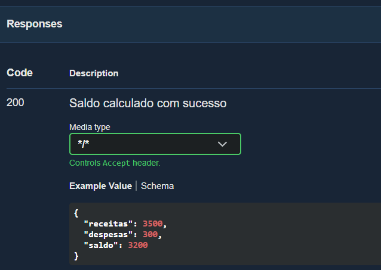
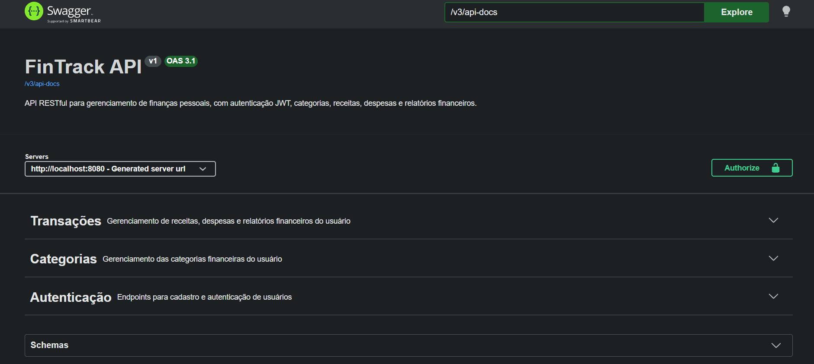
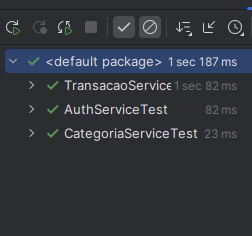
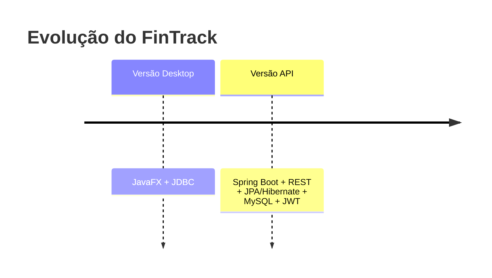

<div align="center">

# 💰 FinTrack API

### API RESTful para gerenciamento de finanças pessoais

*Segura, multiusuário e documentada — construída com Java e Spring Boot*

<br>


<br>

**[Funcionalidades](#-funcionalidades)** • **[Arquitetura](#️-arquitetura)** • **[Segurança](#-segurança)** • **[Como executar](#️-como-executar)** • **[Endpoints](#-referência-rápida-de-endpoints)** • **[Testes](#-testes)**

</div>

---

## 📌 Sobre o projeto

O **FinTrack** permite que cada usuário gerencie suas próprias receitas, despesas e categorias de forma segura, com autenticação via **JWT** e isolamento dos dados financeiros entre usuários.

> Este repositório representa a evolução de uma aplicação desktop desenvolvida inicialmente com **JavaFX + JDBC** para uma arquitetura de back-end baseada em **Spring Boot, Spring Data JPA e Spring Security**.

> 📚 Projeto desenvolvido para fins de estudo e portfólio, aplicando conceitos de arquitetura em camadas, segurança e boas práticas de API REST.



---

## 🚀 Funcionalidades

<table>
<tr>
<td width="50%" valign="top">

**👤 Usuários & Segurança**

* Cadastro de usuários
* Autenticação com JWT
* Senhas criptografadas com BCrypt
* Isolamento de dados por usuário
* Controle de acesso em nível de método

**📁 Categorias**

* CRUD completo
* Nomes únicos por usuário
* Proteção contra exclusão de categorias em uso

</td>
<td width="50%" valign="top">

**💳 Transações**

* CRUD completo de receitas e despesas
* Consulta por categoria
* Consulta por período
* Validação de saldo antes de despesas

**📊 Relatórios**

* Cálculo automático de saldo
* Total de receitas e despesas
* Consultas financeiras via JPQL

</td>
</tr>
</table>

**Também incluído:** validação de dados de entrada · tratamento global de exceções · documentação interativa com Swagger/OpenAPI · testes automatizados da camada de serviço.

---

## 🛠️ Tecnologias

| Categoria | Stack |
| --- | --- |
| **Linguagem** | Java 21 |
| **Framework** | Spring Boot, Spring Web MVC |
| **Persistência** | Spring Data JPA, Hibernate, MySQL |
| **Segurança** | Spring Security, JWT |
| **Validação** | Jakarta Bean Validation |
| **Documentação** | Swagger / OpenAPI |
| **Testes** | JUnit 5, Mockito |
| **Build** | Maven |
| **Ferramentas** | Postman |

---

## 🏗️ Arquitetura

O projeto segue uma arquitetura em camadas, garantindo separação de responsabilidades:



<details>
<summary><strong>📂 Ver estrutura de pastas</strong></summary>

<br>

```text
src/main/java/br/com/anaflavia/fintrack
│
├── config           # Segurança e OpenAPI
├── controller       # Endpoints REST
├── dto
│   ├── request      # Dados de entrada
│   └── response     # Dados de saída
├── entity           # Usuario, Categoria, Transacao
├── enums            # TipoTransacao
├── exception        # Exceções customizadas + handler global
├── repository       # Interfaces JPA
├── security
│   ├── jwt          # Geração/validação de token
│   └── service      # Regras de autorização
├── service          # Regras de negócio
└── FintrackApiApplication.java
```

</details>

---

## 🔐 Segurança

A API utiliza **Spring Security + JWT (JSON Web Token)**.

| Endpoint | Acesso |
| --- | --- |
| `POST /api/auth/register` | 🟢 Público |
| `POST /api/auth/login` | 🟢 Público |
| `/api/v1/usuarios/**` | 🔒 Autenticado |

Além da autenticação, o projeto utiliza autorização em nível de método com `@PreAuthorize`, garantindo que um usuário autenticado somente possa manipular recursos associados ao próprio ID.

```text
Usuário 1 → /api/v1/usuarios/1/transacoes    ✅ Permitido
Usuário 1 → /api/v1/usuarios/2/transacoes    ❌ 403 Forbidden
```

Os dados financeiros são isolados por usuário por meio da autenticação JWT e da autorização em nível de método.

---

## 🔑 Autenticação

<details open>
<summary><strong>📝 Cadastro</strong> — <code>POST /api/auth/register</code></summary>

<br>

```json
{
  "nome": "Ana",
  "email": "ana@email.com",
  "senha": "123456"
}
```

```bash
curl -X POST http://localhost:8080/api/auth/register \
  -H "Content-Type: application/json" \
  -d '{"nome":"Ana","email":"ana@email.com","senha":"123456"}'
```

</details>

<details open>
<summary><strong>🔓 Login</strong> — <code>POST /api/auth/login</code></summary>

<br>

**Requisição**

```json
{
  "email": "ana@email.com",
  "senha": "123456"
}
```

**Resposta**

```json
{
  "token": "eyJ...",
  "tipo": "Bearer",
  "id": 1,
  "nome": "Ana",
  "email": "ana@email.com"
}
```

```bash
curl -X POST http://localhost:8080/api/auth/login \
  -H "Content-Type: application/json" \
  -d '{"email":"ana@email.com","senha":"123456"}'
```

</details>

Para acessar os endpoints protegidos, envie o token no header:

```http
Authorization: Bearer <token>
```

---

## 💳 Transações

<details>
<summary><strong>➕ Criar transação</strong> — <code>POST /api/v1/usuarios/{usuarioId}/transacoes</code></summary>

<br>

**Exemplo de receita**

```json
{
  "descricao": "Salário",
  "valor": 3500.00,
  "data": "2026-08-11",
  "tipo": "RECEITA",
  "categoriaId": 2
}
```

**Exemplo de despesa**

```json
{
  "descricao": "Supermercado",
  "valor": 300.00,
  "data": "2026-08-11",
  "tipo": "DESPESA",
  "categoriaId": 1
}
```

```bash
curl -X POST http://localhost:8080/api/v1/usuarios/1/transacoes \
  -H "Authorization: Bearer $TOKEN" \
  -H "Content-Type: application/json" \
  -d '{"descricao":"Supermercado","valor":300.00,"data":"2026-08-11","tipo":"DESPESA","categoriaId":1}'
```

Tipos disponíveis:

```text
RECEITA
DESPESA
```

</details>

<details>
<summary><strong>📄 Listar transações</strong> — <code>GET /api/v1/usuarios/{usuarioId}/transacoes</code></summary>

<br>

**Resposta**

```json
[
  {
    "id": 1,
    "descricao": "Salário",
    "valor": 3500.00,
    "data": "2026-08-11",
    "tipo": "RECEITA",
    "categoria": {
      "id": 2,
      "nome": "Trabalho"
    }
  },
  {
    "id": 2,
    "descricao": "Supermercado",
    "valor": 300.00,
    "data": "2026-08-11",
    "tipo": "DESPESA",
    "categoria": {
      "id": 1,
      "nome": "Alimentação"
    }
  }
]
```

</details>

---

## 📊 Relatórios financeiros

A API disponibiliza consultas financeiras utilizando **JPQL** no `TransacaoRepository`:

```java
findByUsuarioIdAndDataBetween(...)    // Transações por período
findByUsuarioIdAndCategoriaId(...)    // Transações por categoria
sumValorByUsuarioIdAndTipo(...)       // Total de receitas ou despesas
```

**Exemplo de retorno do saldo** — `GET /api/v1/usuarios/{usuarioId}/transacoes/saldo`

```json
{
  "receitas": 3500.00,
  "despesas": 300.00,
  "saldo": 3200.00
}
```

### 📸 Endpoint de saldo no Swagger

<p align="center">
  
</p>

---

## 🧠 Regras de negócio

| Regra | Comportamento |
| --- | --- |
| 💸 **Saldo insuficiente** | Uma despesa não pode ultrapassar o saldo disponível → `409 Conflict` |
| 🏷️ **Categorias duplicadas** | Um mesmo usuário não pode ter categorias com nomes repetidos |
| 🔒 **Categoria em uso** | Categorias com transações vinculadas não podem ser excluídas |

**Exemplo — saldo insuficiente:**

```http
409 Conflict
```

```json
{
  "erro": "Conflict",
  "mensagem": "Saldo insuficiente para realizar esta despesa.",
  "status": 409
}
```

---

## ✅ Validações

Os dados recebidos são validados utilizando **Jakarta Bean Validation**.

Entre as validações implementadas estão:

* campos obrigatórios;
* formato válido de e-mail;
* tamanho mínimo de senha;
* limites de tamanho de textos;
* valor da transação maior que zero;
* data obrigatória;
* tipo da transação obrigatório;
* categoria obrigatória.

<details>
<summary><strong>Ver exemplo de erro de validação</strong> — <code>400 Bad Request</code></summary>

<br>

```json
{
  "erro": "Bad Request",
  "mensagem": "Erro de validação.",
  "campos": {
    "descricao": "A descrição é obrigatória",
    "valor": "O valor é obrigatório"
  },
  "status": 400
}
```

</details>

---

## ⚠️ Tratamento de erros

A aplicação utiliza um `GlobalExceptionHandler` para padronizar os erros da API.

| Status | Significado |
| --- | --- |
| 🟡 `400` | Requisição ou dados inválidos |
| 🔴 `401` | Usuário não autenticado / credenciais inválidas |
| 🔴 `403` | Usuário sem autorização para acessar o recurso |
| ⚪ `404` | Recurso não encontrado |
| 🟠 `409` | Conflito com uma regra de negócio |
| ⚫ `500` | Erro interno inesperado |

---

## 📖 Swagger / OpenAPI

A API possui documentação interativa com endpoints, DTOs, parâmetros, exemplos e códigos de resposta.

Com a aplicação executando localmente, acesse:

```text
http://localhost:8080/swagger-ui/index.html
```

### 📸 Visão geral da documentação

<p align="center">
  
</p>

---

## ⚙️ Como executar

### Pré-requisitos

* ☕ Java 21
* 📦 Maven
* 🐬 MySQL

### 1️⃣ Clone o repositório

```bash
git clone https://github.com/anaflaviabitu/fintrack-api.git
cd fintrack-api
```

### 2️⃣ Configure o banco de dados

Por padrão, o projeto utiliza:

```text
Banco: fintrack
Host: localhost
Porta: 3306
```

As configurações podem ser fornecidas por variáveis de ambiente:

| Variável | Descrição |
| --- | --- |
| `DB_URL` | URL de conexão com o banco |
| `DB_USERNAME` | Usuário do banco |
| `DB_PASSWORD` | Senha do banco |
| `JWT_SECRET` | Chave secreta utilizada para assinar os tokens JWT |

Exemplo:

```text
JWT_SECRET=sua_chave_secreta
DB_USERNAME=root
DB_PASSWORD=sua_senha
```

> ⚠️ **Nunca publique valores reais de senhas ou chaves JWT no repositório.**

### 3️⃣ Execute a aplicação

**Via IntelliJ IDEA:** execute a classe `FintrackApiApplication`.

**Ou via Maven:**

```bash
mvn spring-boot:run
```

A API estará disponível em:

```text
http://localhost:8080
```

---

## 🧪 Testes

O projeto possui testes unitários utilizando **JUnit 5 e Mockito**, cobrindo as principais regras de negócio:

```text
AuthServiceTest         → autenticação e cadastro de usuário
CategoriaServiceTest    → cadastro, duplicidade, atualização e exclusão
TransacaoServiceTest    → receitas, despesas, saldo e regras financeiras
```

Para executar todos os testes:

```bash
mvn test
```

### ✅ Execução dos testes

<p align="center">
  
</p>

---

## 📎 Referência rápida de endpoints

<details>
<summary><strong>Clique para expandir a lista completa</strong></summary>

<br>

### Autenticação

| Método | Rota |
| --- | --- |
| `POST` | `/api/auth/register` |
| `POST` | `/api/auth/login` |

### Categorias

| Método | Rota |
| --- | --- |
| `POST` | `/api/v1/usuarios/{usuarioId}/categorias` |
| `GET` | `/api/v1/usuarios/{usuarioId}/categorias` |
| `GET` | `/api/v1/usuarios/{usuarioId}/categorias/{categoriaId}` |
| `PUT` | `/api/v1/usuarios/{usuarioId}/categorias/{categoriaId}` |
| `DELETE` | `/api/v1/usuarios/{usuarioId}/categorias/{categoriaId}` |

### Transações

| Método | Rota |
| --- | --- |
| `POST` | `/api/v1/usuarios/{usuarioId}/transacoes` |
| `GET` | `/api/v1/usuarios/{usuarioId}/transacoes` |
| `GET` | `/api/v1/usuarios/{usuarioId}/transacoes/{transacaoId}` |
| `PUT` | `/api/v1/usuarios/{usuarioId}/transacoes/{transacaoId}` |
| `DELETE` | `/api/v1/usuarios/{usuarioId}/transacoes/{transacaoId}` |
| `GET` | `/api/v1/usuarios/{usuarioId}/transacoes/saldo` |
| `GET` | `/api/v1/usuarios/{usuarioId}/transacoes/categoria/{categoriaId}` |
| `GET` | `/api/v1/usuarios/{usuarioId}/transacoes/periodo?inicio=...&fim=...` |

</details>

---

## 🔄 Evolução do projeto



O FinTrack começou como uma aplicação desktop construída com **JavaFX e JDBC** e evoluiu para uma API RESTful com uma arquitetura voltada à separação de responsabilidades, segurança e integração com diferentes tipos de clientes.

---

## 🔮 Possíveis evoluções

* [ ] Paginação e ordenação das transações
* [ ] Migrations de banco de dados com Flyway
* [ ] Testes de integração e segurança
* [ ] Dockerização do projeto
* [ ] Filtros financeiros adicionais
* [ ] Dashboard web ou mobile consumindo a API
* [ ] Deploy em ambiente cloud

---

## 🤝 Contribuindo

Este é um projeto de estudo, mas sugestões são bem-vindas! Sinta-se à vontade para abrir uma [issue](https://github.com/anaflaviabitu/fintrack-api/issues) ou enviar um pull request.

---

<div align="center">

## 👩‍💻 Autora

**Ana Flávia Bitu**

Projeto desenvolvido para estudo e aplicação prática de desenvolvimento back-end com Java e Spring Boot.

**Repositório:** https://github.com/anaflaviabitu/fintrack-api  
**GitHub:** [@anaflaviabitu](https://github.com/anaflaviabitu)

</div>
